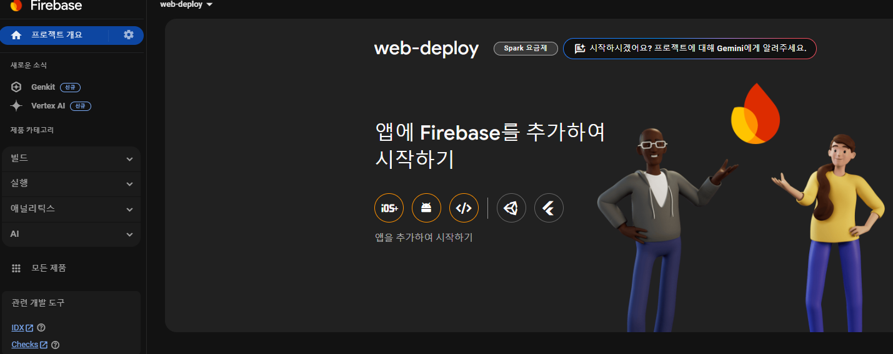
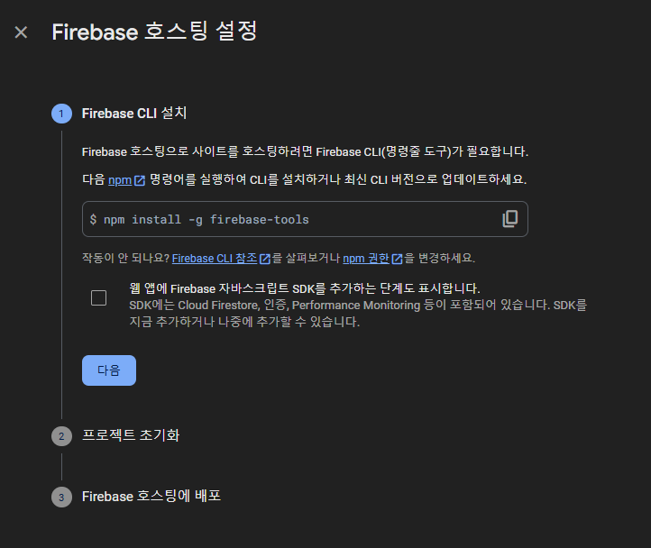
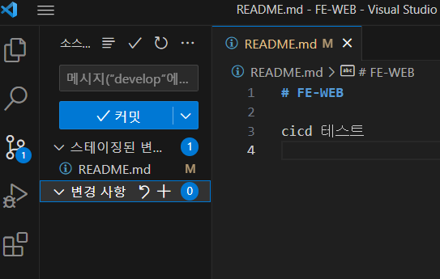
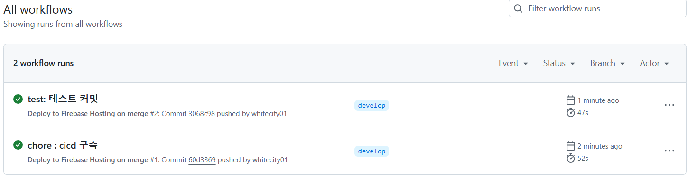
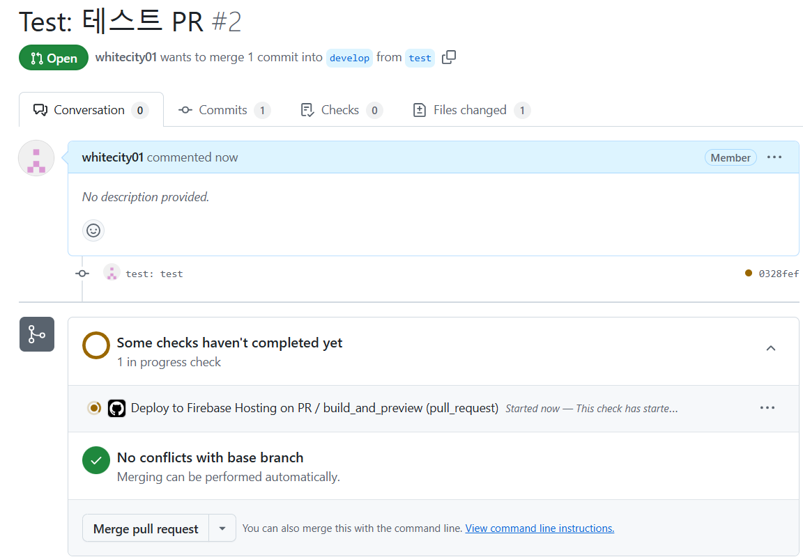
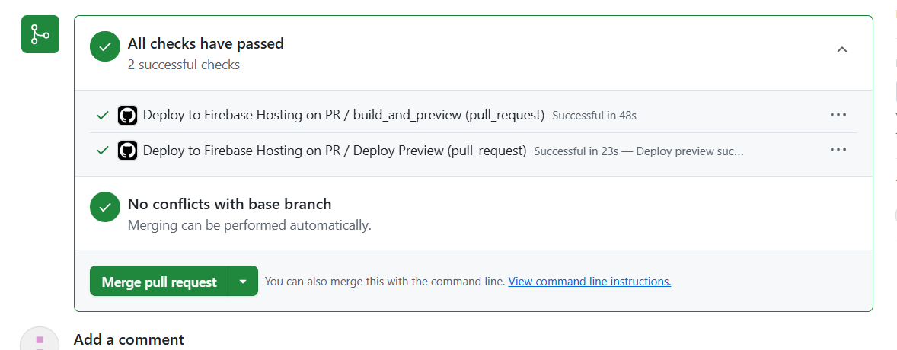
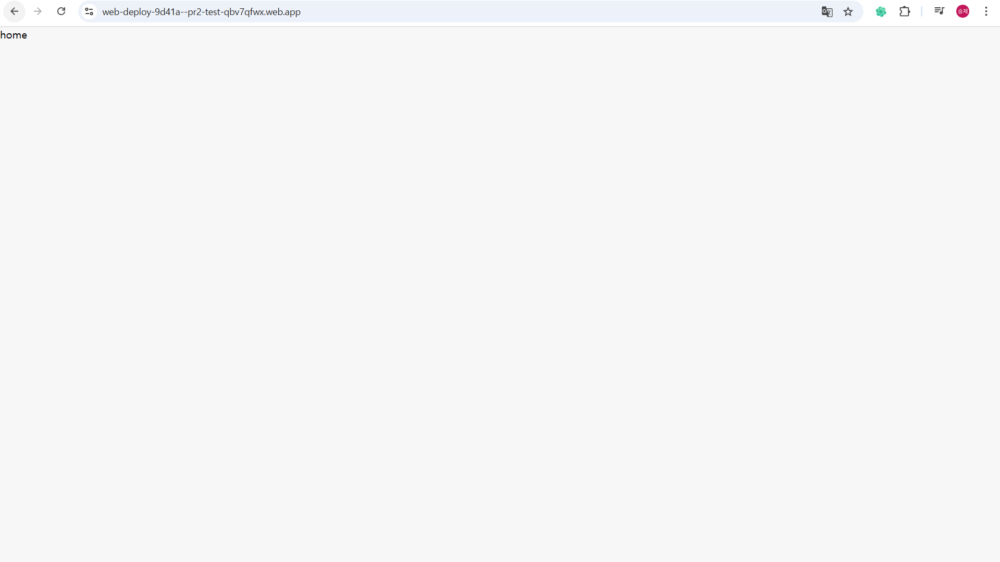

새로운 프로젝트를 시작하면서 디자인 팀의 합류가 예상보다 늦어져, 체계적인 일정 관리가 필요하게 되었다. 이에 따라, 프론트엔드 개발의 진행 상황을 디자인 팀이 직관적으로 파악할 수 있도록 해야 했고, 이를 자동 배포 시스템을 활용해 해결하고자 했다. 또한, 3명으로 구성된 프론트엔드 팀이 보다 효율적으로 협업할 수 있도록, 코드 오류를 최소화하고 배포 과정을 간소화하기 위해 CI/CD 파이프라인을 구축하기로 결정했다.

파이프라인 구상도는 다음과 같다.

***PR -> GitHub Action -> 빌드 및 테스트 성공 -> firebase 배포***

## 1. 파이어베이스 프로젝트 생성

## 2. 호스팅 시작

이제 해당 페이지에서 요구하는 절차대로 진행하면 성공적으로 배포설정이 완료된다.

## 3. 테스트

배포설정을 완료하고 develop 브랜치에서 제대로 action이 작동하는지 테스트 해보았다.

아주 잘 작동한다.

새로운 브랜치에서 PR을 했을 때도 정상적으로 테스트가 실행된다.

음 굿

배포도 정상적으로 되는 것을 확인할 수 있다.

음 역시 대기업 답게 배포하는 과정이 매우 간편하고 쉽다.
다음에는 브랜치 규칙 설정 및 프로젝트 초기세팅에 대해 공부할 예정이다.